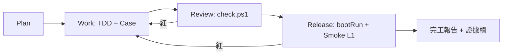
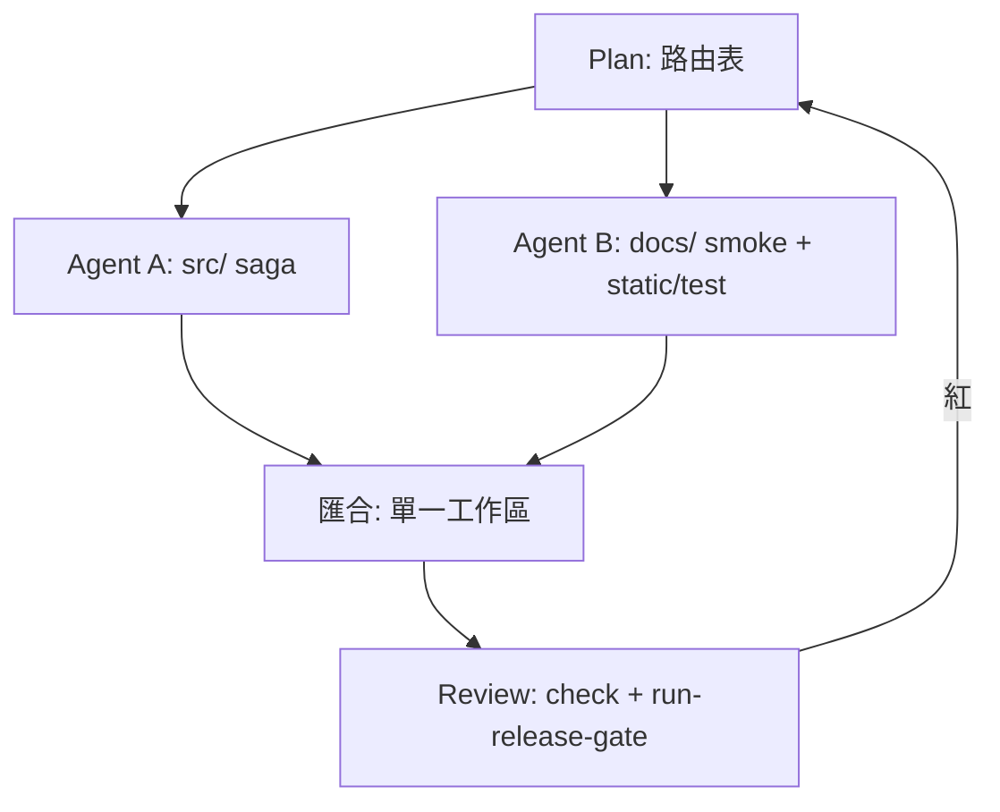

# Graph 路由（最小落地）

> **權威規則：** EngineeringOS `knowledge/agent-engineering.md` §3 Graph Engineering  
> **本檔定位：** 本專案怎麼套「節點／邊／狀態」；**非**第二套規則。  
> **與 CodeGraphic 無關：** `docs/codeGraphic.html` 是架構教學圖，不是多 Agent 編排。

## 一句話

- **單 Agent**（你 + 一個 Cursor）：完工報告 `EOS-GRAPH`＝**N/A** 即合規。  
- **≥2 Agent 並行**：Plan 必須寫清本檔的節點、寫入路徑、匯合點。  
- **狀態真相（SSOT）：** 規格／Case ID、`git` 工作區、`check` 結果、Smoke 終端訊號、完工報告——不靠「對話記憶」。

---

## 本專案預設拓樸（單 Agent · Release）

日常與推版共用同一條 Loop；Smoke **不**進 `scripts/check.ps1`（Pure），由 `docs/` 編排。



| 節點 | 產物 | 通過條件 |
|------|------|----------|
| **Plan** | Scope、Case 是否受影響 | 人工／任務描述核准 |
| **Work** | 程式 + 成對測試 | 對應 SAGA/TCC/TRADE… Case 有改到 |
| **Review** | `scripts/check.ps1` | `BUILD SUCCESSFUL` |
| **Release** | `docs/run-release-gate.ps1` 或分開 `run-smoke-l1.ps1` | `ALL_API_SMOKE_OK`；UI 可選 `PASS`／`N/A` |
| **匯合** | `docs/work-completion-reports/*.md` | 雙通道：檔案 + 對話面板 |

**編排腳本（不破 Pure）：**

```powershell
.\gradlew.bat bootRun              # 終端 1
.\docs\run-release-gate.ps1        # 終端 2：check + L1（bootRun 須已 UP）
# 僅 check：.\docs\run-release-gate.ps1 -SkipSmoke
# 僅 Smoke（check 已綠）：.\docs\run-release-gate.ps1 -SkipCheck
```

---

## 多 Agent 範例（僅在並行時啟用）

改 **Saga 後端** 與 **Smoke 腳本** 可拆兩個 Agent，但**禁止**無路由並行改同一檔。



| 邊 | 規則 |
|----|------|
| A → M | 只寫 `src/`、`src/test/`；不動 `docs/run-*-smoke.ps1` |
| B → M | 只寫 `docs/`、`static/test/`；劇情對齊 Case ID |
| M → R | **先** `check` **再** Smoke；禁止只跑單元就宣稱 Release 完成 |
| R 紅 → Plan/Work | 契約衝突或並行改同一檔 → 回 Work 序列化 |

---

## 狀態契約（可觀測）

| 狀態 | 放哪 | 禁止 |
|------|------|------|
| 契約 | `API規格書.md`、Case 表（`docs/testing.md`） | Agent 口頭改 API 不落盤 |
| 測試綠燈 | `gradlew check` 輸出 | 跳過 check 宣告完成 |
| Demo 綠燈 | `ALL_L0_SMOKE_OK`／`ALL_API_SMOKE_OK`／`ALL_UI_SMOKE_OK` | check 綠就說可 Demo |
| 留痕 | `docs/work-completion-reports/` | 只口頭說「好了」 |

---

## 完工報告：`EOS-GRAPH` 怎麼填

| 情境 | 填法 |
|------|------|
| 單 Agent 完成本次任務 | `EOS-GRAPH`＝**N/A**（理由：單 Agent） |
| ≥2 Agent 並行 | 列節點（誰改哪目錄）、匯合點（Review 前）、是否發生檔案衝突 |

範例（單 Agent）：

```text
EOS-GRAPH: N/A — 單 Agent；拓樸見 docs/graph-routing.md 預設圖
```

---

## 禁止（與公版一致）

```text
❌ 多 Agent 無路由表並行改同一模組
❌ 把 Smoke 塞進 scripts/check.ps1（破壞 Pure）
❌ Review 未 harness 綠就寫 Release 證據欄
❌ 對話裡決策了 Case 卻沒更新測試／Smoke 劇情
```

## 延伸閱讀

- Loop／Gate：`EngineeringOS/eos-minimal/PLAYBOOK.md`
- Demo-ready：`docs/testing.md`、EOS `demo-ready-guide.md`
- 架構圖（非 Graph）：`docs/codeGraphic.html`
