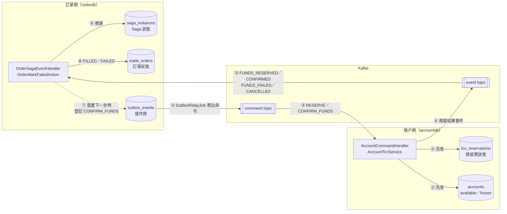
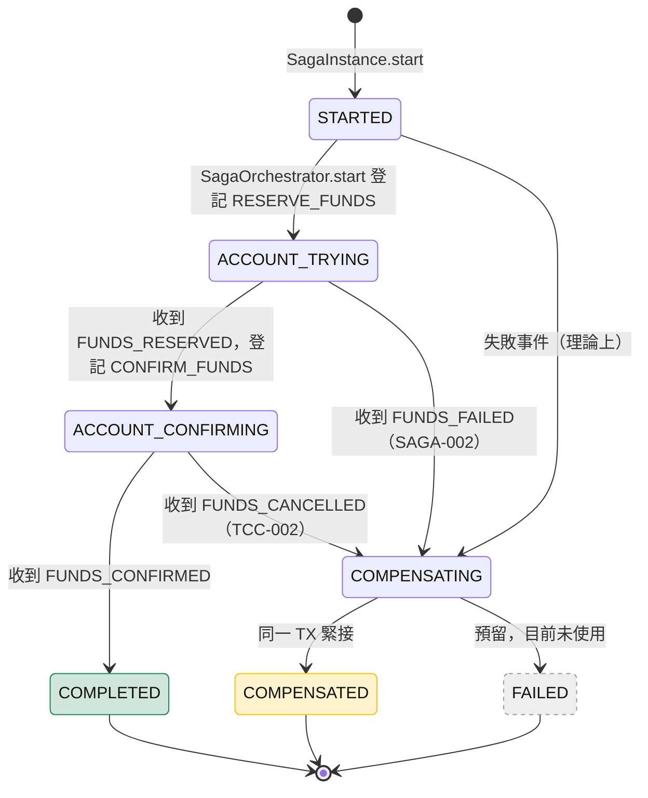
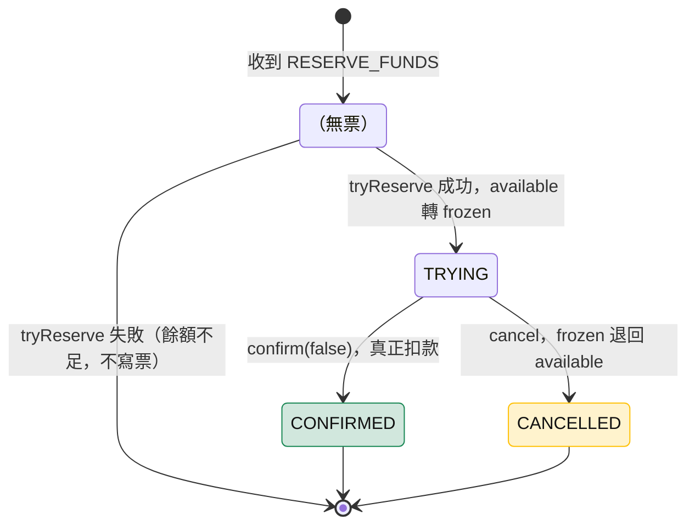
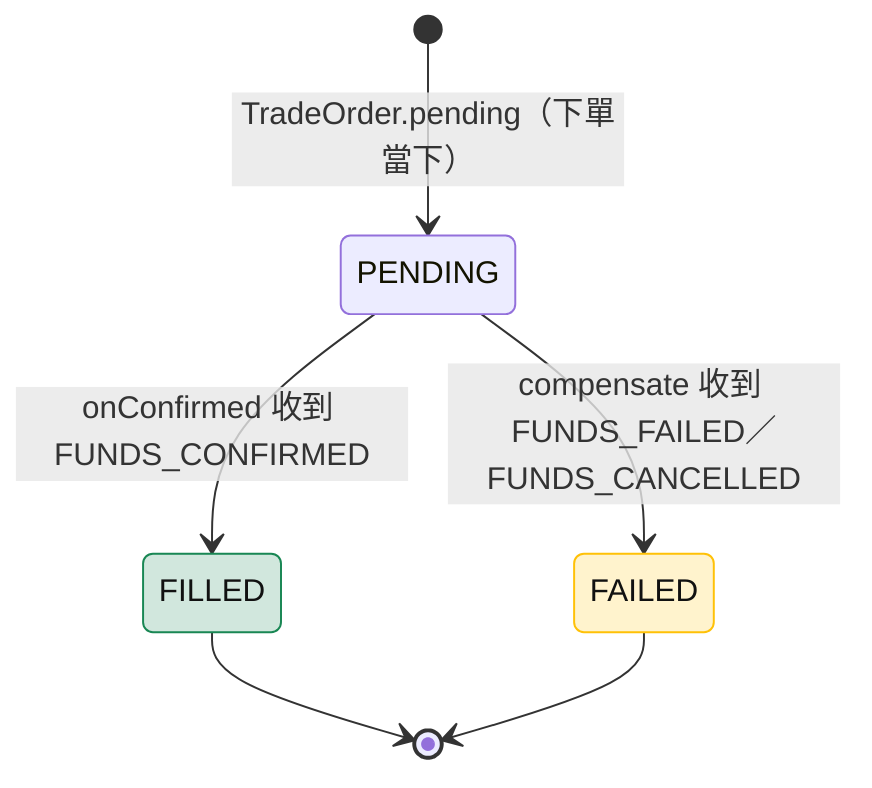
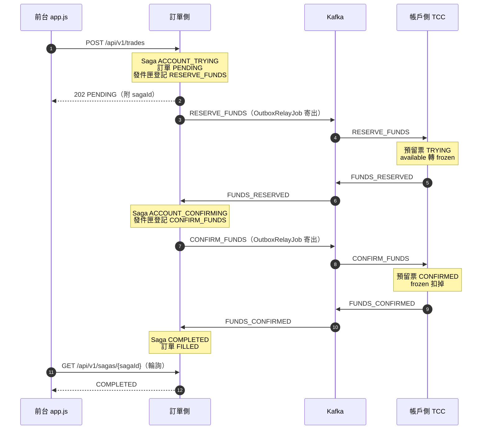
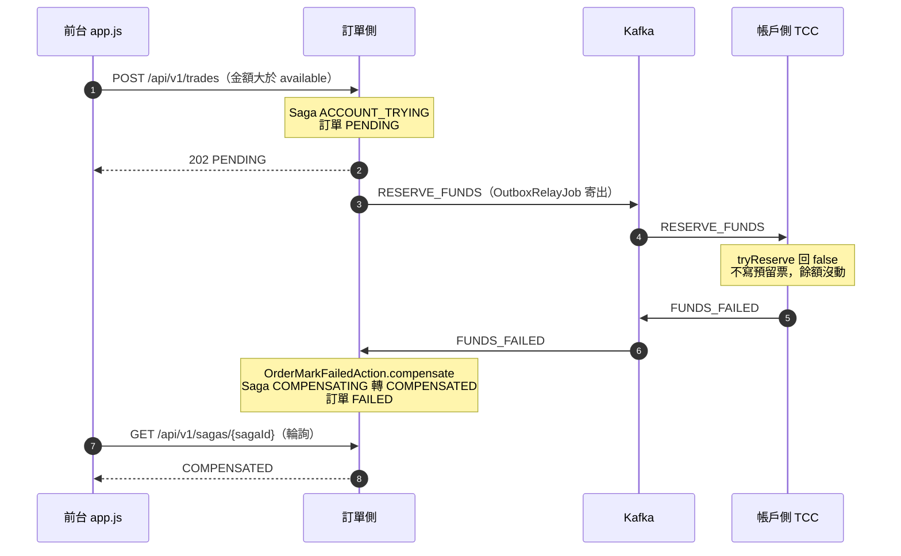
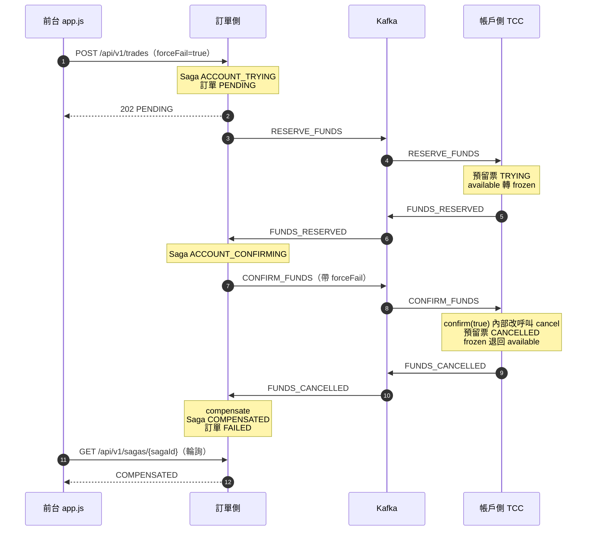
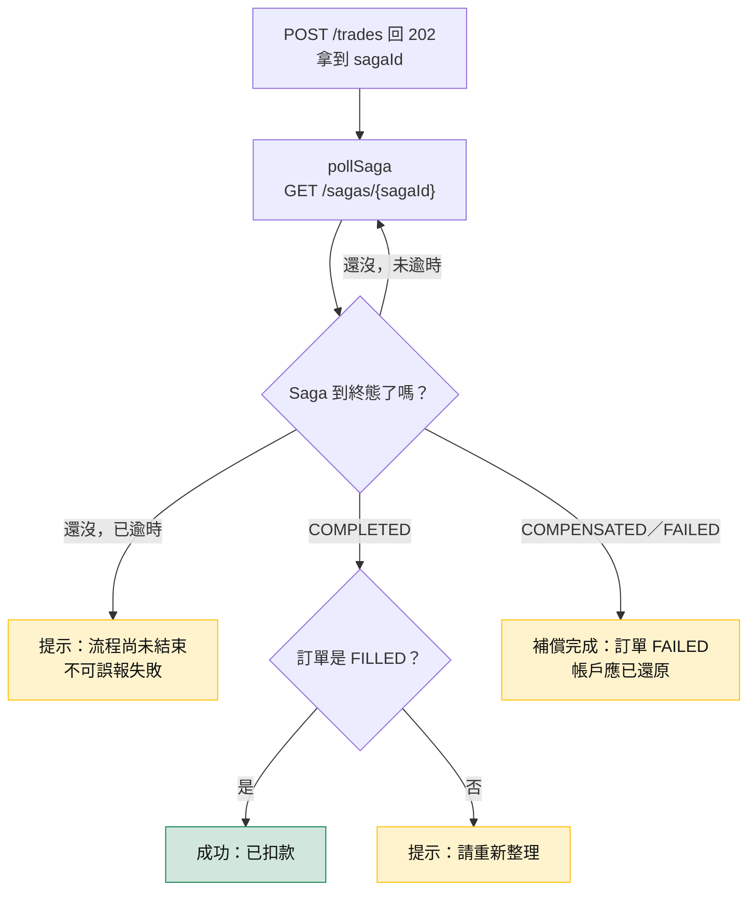

# 狀態對照：Saga／TCC 預留票／訂單

> 衝突以主規格／[architecture.md](architecture.md) 為準。本檔為學習敘述（VIEW）。  
> 程式權威：`SagaStatus`、`TccState`、`OrderStatus` 三個 enum 的 JavaDoc。

## 1. 一句話

**Saga 是「流程進度表」，TCC 預留票是「帳戶的資金憑證」，訂單是「給使用者看的結果」。**  
三者存在不同表（Saga／訂單在 orderdb，預留票在 accountdb），彼此不直接讀取，只靠同一個 `sagaId` 與 Kafka 事件串起來。

## 2. 三組狀態總覽

| | Saga 狀態 | TCC 預留票狀態 | 訂單狀態 |
|--|-----------|----------------|----------|
| Enum | `SagaStatus` | `TccState` | `OrderStatus` |
| 表 | orderdb `saga_instances` | accountdb `tcc_reservations` | orderdb `trade_orders` |
| 管什麼 | 整個流程走到哪一步 | 這筆錢是凍結、已扣、還是已退 | 對使用者而言成交了沒 |
| 誰改它 | 訂單側：`SagaOrchestrator`、`OrderSagaEventHandler`、`OrderMarkFailedAction` | 帳戶側：`AccountTccService` | 訂單側：`OrderSagaEventHandler`、`OrderMarkFailedAction` |
| 值 | `STARTED`、`ACCOUNT_TRYING`、`ACCOUNT_CONFIRMING`、`COMPLETED`、`COMPENSATING`、`COMPENSATED`、`FAILED` | `TRYING`、`CONFIRMED`、`CANCELLED` | `PENDING`、`FILLED`、`FAILED` |
| 什麼時候出現 | 下單當下建立 | **Try 成功才寫一列**；Try 失敗根本沒有這張票 | 下單當下建立 |
| 轉換規則放哪 | `SagaStatus.canTransitionTo`（集中規則表） | `TccReservation.markConfirmed`／`markCancelled` | `TradeOrder.markFilled`／`markFailed` |

### 全景圖：狀態怎麼在兩庫之間流動

兩庫之間**沒有直接連線**，只靠 Kafka 事件傳話。帳戶側改完預留票才發事件，訂單側收到事件才改 Saga 和訂單。



圖上編號就是一輪的順序：命令從發件匣出發（①②），帳戶側先改自己的表（③）才發事件（④），訂單側收到後改 Saga 與訂單（⑤⑥）；成功路徑還需要 Confirm，就再往發件匣登記一道命令（⑦），回到 ①。

## 3. 各自的狀態圖

### Saga（流程）



<details>
<summary>純文字版</summary>

```text
正向：STARTED → ACCOUNT_TRYING → ACCOUNT_CONFIRMING → COMPLETED
負向：STARTED／ACCOUNT_TRYING／ACCOUNT_CONFIRMING → COMPENSATING → COMPENSATED
預留：COMPENSATING → FAILED（目前沒有程式走到）
```

</details>

| 狀態 | 誰設定 | 觸發時機 |
|------|--------|----------|
| `STARTED` | `SagaInstance.start` | 建立實體（初始值），同 TX 立刻轉下一步 |
| `ACCOUNT_TRYING` | `SagaOrchestrator.start` | 發件匣登記 `RESERVE_FUNDS` |
| `ACCOUNT_CONFIRMING` | `OrderSagaEventHandler.onReserved` | 收到 `FUNDS_RESERVED`，登記 `CONFIRM_FUNDS` |
| `COMPLETED` | `OrderSagaEventHandler.onConfirmed` | 收到 `FUNDS_CONFIRMED` |
| `COMPENSATING` | `OrderMarkFailedAction.compensate` | 收到 `FUNDS_FAILED`／`FUNDS_CANCELLED`（中間態） |
| `COMPENSATED` | `OrderMarkFailedAction.compensate` | 同一 TX 緊接 `COMPENSATING` |
| `FAILED` | （無） | 預留：補償本身也失敗時使用 |

### TCC 預留票（資金）



<details>
<summary>純文字版</summary>

```text
（無票）──Try 成功──► TRYING ──Confirm──► CONFIRMED
                         │
                         └──Cancel──► CANCELLED

Try 失敗（餘額不足）：不寫票，停在「無票」
```

</details>

| 狀態 | 帳戶餘額變化 | 誰設定 |
|------|--------------|--------|
| （無票） | 沒動 | — |
| `TRYING` | available → frozen（凍結） | `AccountTccService.tryReserve` |
| `CONFIRMED` | frozen 消失（真正扣款，total 下降） | `AccountTccService.confirm(false)` |
| `CANCELLED` | frozen → available（退回） | `AccountTccService.cancel`（forceFail 時由 `confirm(true)` 內部呼叫） |

限制：`CONFIRMED` 之後不能再 Cancel（`markCancelled` 會丟例外）；已 `CANCELLED` 再 Cancel 是空操作（冪等）。

### 訂單（結果）



## 4. 三個情境逐步對照

每個情境先看時序圖（誰傳話給誰、狀態在哪一刻改變），再看表格（每一步三張表各自的值）。注意 TCC 永遠比 Saga 先變。

### SAGA-001 成功



| 步驟 | 事件／動作 | Saga | 預留票 | 訂單 |
|------|-----------|------|--------|------|
| 1 | `POST /trades`，`SagaOrchestrator.start` | `ACCOUNT_TRYING` | （無票） | `PENDING` |
| 2 | 郵差寄出 `RESERVE_FUNDS` → 帳戶 Try 成功 | `ACCOUNT_TRYING` | `TRYING` | `PENDING` |
| 3 | 訂單側收到 `FUNDS_RESERVED` | `ACCOUNT_CONFIRMING` | `TRYING` | `PENDING` |
| 4 | 郵差寄出 `CONFIRM_FUNDS` → 帳戶 Confirm | `ACCOUNT_CONFIRMING` | `CONFIRMED` | `PENDING` |
| 5 | 訂單側收到 `FUNDS_CONFIRMED` | **`COMPLETED`** | `CONFIRMED` | **`FILLED`** |

### SAGA-002 餘額不足



| 步驟 | 事件／動作 | Saga | 預留票 | 訂單 |
|------|-----------|------|--------|------|
| 1 | `POST /trades`（金額大於 available） | `ACCOUNT_TRYING` | （無票） | `PENDING` |
| 2 | 帳戶 Try 失敗，**不寫票** | `ACCOUNT_TRYING` | （無票） | `PENDING` |
| 3 | 訂單側收到 `FUNDS_FAILED` → 補償 | **`COMPENSATED`** | （無票） | **`FAILED`** |

帳戶餘額從頭到尾沒動過。

### TCC-002 forceFail（Confirm 階段故意失敗）



| 步驟 | 事件／動作 | Saga | 預留票 | 訂單 |
|------|-----------|------|--------|------|
| 1 | `POST /trades`（`forceFail=true`） | `ACCOUNT_TRYING` | （無票） | `PENDING` |
| 2 | 帳戶 Try 成功 | `ACCOUNT_TRYING` | `TRYING` | `PENDING` |
| 3 | 訂單側收到 `FUNDS_RESERVED` | `ACCOUNT_CONFIRMING` | `TRYING` | `PENDING` |
| 4 | `confirm(true)` 內部改走 Cancel | `ACCOUNT_CONFIRMING` | `CANCELLED` | `PENDING` |
| 5 | 訂單側收到 `FUNDS_CANCELLED` → 補償 | **`COMPENSATED`** | `CANCELLED` | **`FAILED`** |

凍結的錢已退回 available。

### 終態組合速查

| 情境 | Saga | 預留票 | 訂單 | 帳戶 available |
|------|------|--------|------|----------------|
| SAGA-001 成功 | `COMPLETED` | `CONFIRMED` | `FILLED` | 減少 |
| SAGA-002 餘額不足 | `COMPENSATED` | （無票） | `FAILED` | 不變 |
| TCC-002 forceFail | `COMPENSATED` | `CANCELLED` | `FAILED` | 不變（先凍結後退回） |

## 5. 為什麼會「暫時對不上」

帳戶側先改預留票，再發 Kafka 事件；訂單側收到事件才更新 Saga 與訂單。  
所以上表步驟 2、4 會看到「預留票已經變了，Saga 還沒變」。這是**最終一致**：兩庫沒有 XA 全域事務（見 [資料庫設計.md](資料庫設計.md)），只保證事件送達後會對齊。

前台因此要：

- **輪詢 Saga**（`GET /api/v1/sagas/{sagaId}`）直到終態，而不是看 HTTP 202 就下結論；
- **同時看 Saga 與訂單**再下結論（`app.js` 的 `reportOutcome`）；
- 輪詢逾時只能說「還沒結束」，不能誤報成失敗。

前台判讀流程（`pollSaga` → `reportOutcome`）：



## 6. 常見誤會

| 誤會 | 實際 |
|------|------|
| `CANCELLED` 和 `COMPENSATED` 是同一件事 | 層級不同。`CANCELLED` 是「這筆錢已退回」（單一資源）；`COMPENSATED` 是「整個流程的失敗處理已收尾」。SAGA-002 就是 Saga `COMPENSATED` 但根本沒有預留票 |
| 訂單 `FAILED` 表示系統出錯 | 不是。Saga `COMPENSATED`＋訂單 `FAILED` 是失敗路徑**正確收尾** |
| 看得到 `COMPENSATING` | 幾乎看不到：`compensate` 在同一 TX 內先轉 `COMPENSATING` 再立刻轉 `COMPENSATED` |
| Saga `FAILED` 會出現 | 目前沒有程式設定它，只是狀態機預留的出口 |
| TCC 知道流程在「確認中」 | 不知道。預留票只記錢的狀況；「現在在等誰」只有 Saga 會記 |
| 編排者會發 `CANCEL_FUNDS` | 目前不會。帳戶側有處理 `CANCEL_FUNDS`，但沒有程式發送；本版的 Cancel 只由 forceFail 觸發 |

## 7. 重送時怎麼不出錯（冪等）

Kafka 可能重送同一則事件，三邊各自防重：

| 位置 | 防重方式 |
|------|----------|
| Saga | `OrderSagaEventHandler`、`OrderMarkFailedAction` 看到 `isTerminal()` 直接 return；重送的 `FUNDS_RESERVED` 看到 `ACCOUNT_CONFIRMING` 也略過 |
| 預留票 | PK＝`sagaId`。Try 看到票已存在就不再凍結；Confirm 看到 `CONFIRMED` 直接回成功；Cancel 看到 `CANCELLED` 直接略過 |
| 狀態機 | `SagaStatus.canTransitionTo` 讓終態回 false，即使有漏網之魚也改不動已結束的 Saga |

## 8. 怎麼自己觀察

1. `bootRun` 後開 http://localhost:8093/
2. 下單後記下 `sagaId`，查：
   - `GET /api/v1/sagas/{sagaId}` — Saga 狀態與步驟軌跡
   - `GET /api/v1/trades/{orderId}` — 訂單狀態
   - `GET /api/v1/accounts/ACC-001` — available／frozen
   - `GET /api/v1/events` — Kafka 走過哪些訊息 type
3. 分別用一般下單、超額下單、`forceFail=true` 跑三個情境，對照第 4 節的表。
4. 每輪前可 `POST /api/v1/accounts/ACC-001/reset` 還原種子餘額。

## 9. 相關程式

| 主題 | 位置 |
|------|------|
| Saga 狀態與規則 | `order/domain/SagaStatus.java`、`SagaInstance.transitionTo` |
| 預留票 | `account/domain/TccState.java`、`TccReservation.java`、`AccountTccService.java` |
| 訂單 | `order/domain/OrderStatus.java`、`TradeOrder.java` |
| 事件推進 | `messaging/OrderSagaEventHandler.java` |
| 補償 | `saga/OrderMarkFailedAction.java` |
| 前台判讀 | `static/app.js` 的 `pollSaga`、`reportOutcome` |
| 延伸閱讀 | [outbox-發件匣.md](outbox-發件匣.md)（命令怎麼寄出）、[codeGraphic.html](codeGraphic.html)（正負向流程圖） |

## 10. 一句話複習

**預留票先變、Saga 後跟；成功看 `COMPLETED`＋`FILLED`，失敗看 `COMPENSATED`＋`FAILED`；錢有沒有還，看預留票和 available。**
